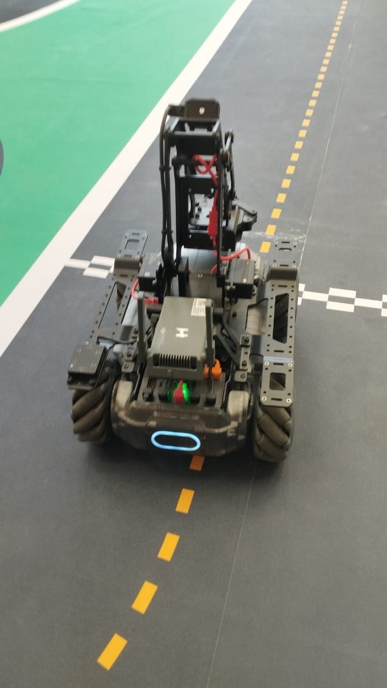

# MobileRobot-Openloopcontrol
## Aim:

To develop a python control code to move the mobilerobot along the predefined path.

## Equipments Required:
1. RoboMaster EP core
2. Python 3.7

## Procedure

#### Step1:

Import the robomaster and time.

#### Step2:

Initialize the robot.

#### Step3:

Start video streaming.

#### Step4:

Measure the path in meters and perform movements and set LED colors.

#### Step5:

Stop video streaming.

#### Step6:

Close the robot connection.

#### Step7:

End the Program.

## Program
```python
from robomaster import robot
import time
from robomaster import camera

if _name_ == '_main_':
    ep_robot = robot.Robot()
    ep_robot.initialize(conn_type="ap")

    ep_chassis = ep_robot.chassis
    ep_led = ep_robot.led
    ep_camera = ep_robot.camera

    print("Video streaming started.....")
    ep_camera.start_video_stream(display=True, resolution = camera.STREAM_360P)


    ep_chassis.move(x=2.8,y=0,z=0,xy_speed=1).wait_for_completed()
    ep_led.set_led(comp = "all",r=255,g=204,b=0,effect="on")

    ep_chassis.move(x=0,y=0,z=50,xy_speed=1).wait_for_completed()
    ep_led.set_led(comp = "all",r=153,g=51,b=102,effect="on")

    ep_chassis.move(x=0.6,y=0,z=0,xy_speed=1).wait_for_completed()
    ep_led.set_led(comp = "all",r=255,g=204,b=0,effect="on")

    ep_chassis.move(x=0,y=0,z=55,xy_speed=1).wait_for_completed()
    ep_led.set_led(comp = "all",r=153,g=51,b=102,effect="on")

    ep_chassis.move(x=0.6,y=0,z=0,xy_speed=1).wait_for_completed()
    ep_led.set_led(comp = "all",r=255,g=204,b=0,effect="on")

    ep_chassis.move(x=0,y=0,z=62,xy_speed=1).wait_for_completed()
    ep_led.set_led(comp = "all",r=0,g=0,b=255,effect="on")

    ep_chassis.move(x=1.5,y=0,z=0,xy_speed=1).wait_for_completed()
    ep_led.set_led(comp = "all",r=255,g=0,b=0,effect="on")

    ep_chassis.move(x=0,y=0,z=-28,xy_speed=1).wait_for_completed()
    ep_led.set_led(comp = "all",r=0,g=255,b=0,effect="on")

    ep_chassis.move(x=1.3,y=0,z=0,xy_speed=1).wait_for_completed()
    ep_led.set_led(comp = "all",r=102,g=0,b=102,effect="on")

    ep_chassis.move(x=0,y=0,z=40,xy_speed=1).wait_for_completed()
    ep_led.set_led(comp = "all",r=255,g=0,b=255,effect="on")

    ep_chassis.move(x=1.5,y=0,z=0,xy_speed=1).wait_for_completed()
    ep_led.set_led(comp = "all",r=0,g=255,b=255,effect="on")

    ep_chassis.move(x=0,y=0,z=90,xy_speed=1).wait_for_completed()
    ep_led.set_led(comp = "all",r=0,g=128,b=0,effect="on")

    ep_chassis.move(x=1.8,y=0,z=0,xy_speed=1).wait_for_completed()
    ep_led.set_led(comp = "all",r=0,g=0,b=128,effect="on")

    ep_chassis.move(x=0,y=0,z=55,xy_speed=1).wait_for_completed()
    ep_led.set_led(comp = "all",r=0,g=255,b=255,effect="on")

    ep_chassis.move(x=0.5,y=0,z=0,xy_speed=1).wait_for_completed()
    ep_led.set_led(comp = "all",r=0,g=204,b=255,effect="on")
    
    ep_chassis.move(x=0,y=0,z=30,xy_speed=1).wait_for_completed()
    ep_led.set_led(comp = "all",r=51,g=102,b=255,effect="on")

    ep_chassis.move(x=0.5,y=0,z=0,xy_speed=1).wait_for_completed()
    ep_led.set_led(comp = "all",r=204,g=204,b=255,effect="on")


    time.sleep(4)
    ep_camera.stop_video_stream()
    print("Stopped video streaming.....")

    ep_robot.close()
```

## MobileRobot Movement Image:



## MobileRobot Movement Video:

Upload your video in Youtube and paste your video-id here

[](https://youtu.be/VmRIhdaA5ZM)


## Result:
Thus the python program code is developed to move the mobilerobot in the predefined path.


```
Mobile Robotics Laboratory
Department of Artificial Intelligence and Data Science/ Machine Learning
Saveetha Engineering College
```
